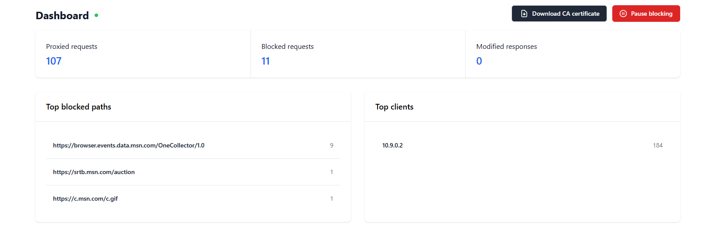
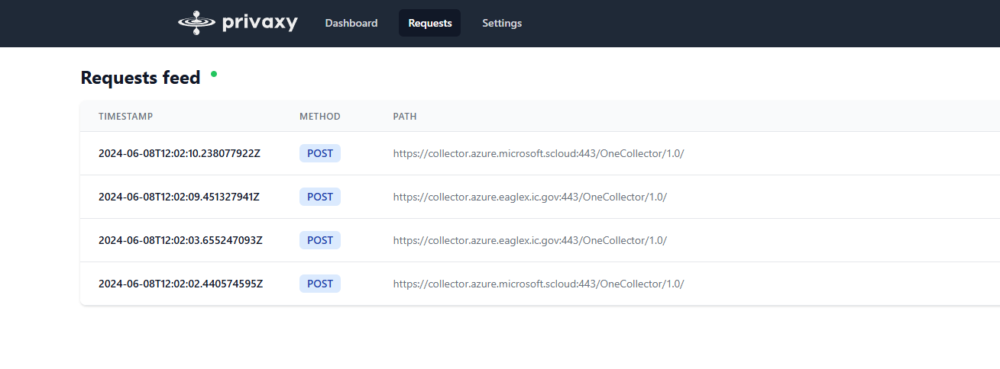
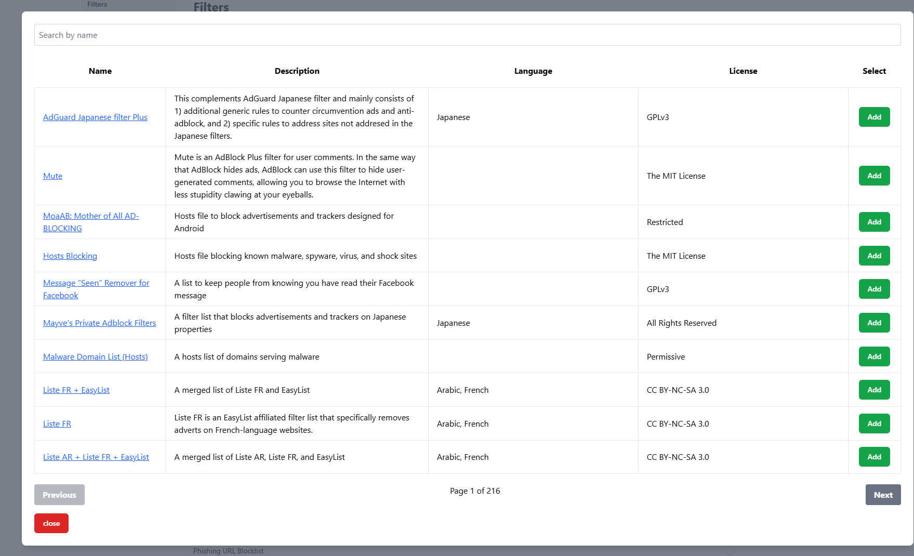
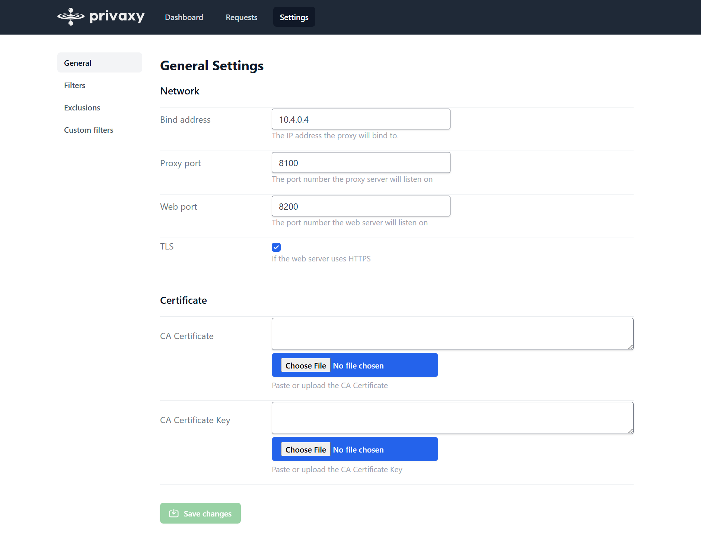
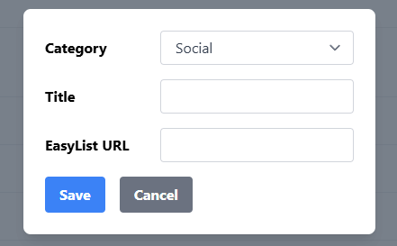

<div align="center">
  

  <h1>Privaxy</h1>

  <p>
    <strong>Next generation tracker and advertisement blocker</strong>
  </p>
</div>

**Forked from the [app version](https://github.com/Barre/privaxy/tree/v0.5.2)**

This reverts it back to [v0.3.1](https://github.com/Barre/privaxy/tree/v0.3.1), but with
newer updates, an improved UI, and server-friendly configuration. To skip to the differences,
[see here](#differences)

See features [here](#features)


<div align="center">






</div>

## About

Privaxy is a MITM HTTP(s) proxy that sits in between HTTP(s) talking applications, such as a web browser and HTTP servers, such as those serving websites.

By establishing a two-way tunnel between both ends, Privaxy is able to block network requests based on URL patterns and to inject scripts as well as styles into HTML documents.

Operating at a lower level, Privaxy is both more efficient as well as more streamlined than browser add-on-based blockers. A single instance of Privaxy on a small virtual machine, server or even, on the same computer as the traffic is originating from, can filter thousands of requests per second while requiring a very small amount of memory.

Privaxy is not limited by the browser’s APIs and can operate with any HTTP traffic, not only the traffic flowing from web browsers.

Privaxy is also way more capable than DNS-based blockers as it is able to operate directly on URLs and to inject resources into web pages.

## Features

- Suppport for [Adblock Plus filters](https://adblockplus.org/filter-cheatsheet), such as [easylist](https://easylist.to/).
- Web graphical user interface with a statistics display as well as a live request explorer.
- Support for uBlock origin's `js` syntax.
- Support for uBlock origin's `redirect` syntax.
- Support for uBlock origin's scriptlets.
- Browser and HTTP client agnostic.
- Support for custom filters.
- Support for excluding hosts from the MITM pipeline.
- Support for protocol upgrades, such as with websockets.
- Automatic filter lists updates.
- Very low resource usage.
  - Around 50MB of memory with approximately 320 000 filters enabled.
  - Able to filter thousands of requests per second on a small machine.
- PAC generation for easy client setup
- [filterlists.com](https://filterlists.com) integration
- Ability to add custom filters

## Installation

You can either utilize the docker image, binary, or the deb avaiable in releases.

### Debian/Ubuntu

Download and install the .deb from the release

### RHEL/Fedora/Rocky

Download and install the .rpm from the release

### MIPS

Download and install the deb/rpm/binary with mips in the name

### Docker

`docker run -d --name privaxy --restart unless-stopped -p 8100:8100 -p 8200:8200 -v /path/to/conf:/conf privaxy:ghcr.io/joshrmcdaniel/privaxy:dev`

### From source

```sh
# 1. Frontend 
cd web_frontend
npm i
trunk build --release

# 2. Backend
cd ..
cargo build --release
```

**The frontend must be built before the backend — the server embeds `web_frontend/dist/` via `include_dir!` and won't compile without it.**

Build requirements:

- Rust 1.87+
- Node.js
- Trunk

### Docker Compose


```yaml
services:
  privaxy:
    image: ghcr.io/joshrmcdaniel/privaxy:dev
    ports:
      - "8100:8100"
      - "8200:8200"
    volumes:
      - path/to/conf:/conf
    restart: unless-stopped
```

## Setup

### 1. First-run web UI

Open `http://<host>:8200` in a browser. On first launch, the web UI walks
you through:

1. Creating a username and password for the web UI. The
   same account is used for every subsequent login. Programmatic clients
   can also authenticate via the `X-Api-Key` header. The key is shown in
   Settings → Account.
2. Selecting which filter lists to enable (you can also browse
   [filterlists.com](https://filterlists.com) from Settings → Filters).

On first run, privaxy auto-generates a root CA + private key and writes
them to its config directory. If you'd rather use your own CA, replace the
values under `[ca]` in the config file (or upload via Settings → General)
and restart.

### 2. Install the root CA on your client devices

Privaxy is a MITM proxy: clients must trust its root CA, otherwise every
HTTPS site will show a certificate error. Download the CA from
Settings → General, then install it as a trusted root on each device:

- **Linux (Debian/Ubuntu, system-wide)**: copy the PEM to
  `/usr/local/share/ca-certificates/privaxy.crt` and run
  `sudo update-ca-certificates`. Firefox uses its own store — import via
  Preferences → Privacy & Security → View Certificates → Authorities.
- **macOS**: open the file in Keychain Access → *System* keychain → mark
  *Always Trust* under the certificate's Trust section.
- **Windows**: double-click the `.crt` → Install Certificate → Local
  Machine → *Place all certificates in the following store* → Trusted Root
  Certification Authorities.
- **iOS**: transfer the file to the device → Settings → General → VPN &
  Device Management → install the profile → Settings → General → About →
  Certificate Trust Settings → enable full trust for the Privaxy CA.
- **Android**: Settings → Security → Encryption & credentials → Install a
  certificate → CA certificate. Note: most apps on modern Android ignore
  user-installed CAs unless they opt in via network security config, so
  privaxy is most useful for browser traffic on mobile.

### 3. Point clients at the proxy

Two options:

- **Manual**: configure your browser/OS to use HTTP proxy `<host>:8100`
  for both HTTP and HTTPS.
- **PAC** (recommended): point the client at
  `http://<host>:8200/proxy.pac`. PAC is served unauthenticated so any
  client on the network can fetch it. Configure direct-bypass rules
  (internal CIDRs, FQDNs) under Settings → PAC.

### 4. Cert-pinned hosts (exclusions)

Some sites use certificate pinning or strict TLS and will break if their traffic is
intercepted. Privaxy handles this two ways:

- An **always-on safety net** for Apple's published service hosts
  (`apple.com`, `icloud.com`, etc., per
  [HT210060](https://support.apple.com/en-us/HT210060)). This is hardcoded
  and not user-editable.
- A **list** of commonly cert-pinned hosts that is
  pre-populated into your editable exclusions on first config creation.
  Settings → Exclusions shows the list; the **Reset to defaults** button
  re-applies the default list. [Source](privaxy/src/server/proxy/exclusions.rs)

Excluded hosts are still CONNECT-tunneled through the proxy, they're just
not decrypted. Filter rules **do not** apply to their traffic.

If you find a site that breaks under MITM, add its hostname (wildcards
like `*.example.com` are supported) to Settings → Exclusions and click
Save. If it's something common, please open an issue so it can be added
to the recommended list.

> **Recovering access**: if you lose the web-UI password, delete the
> `password_hash` value from the config file and restart. The web UI will
> force the setup flow again.

### Future
- Add DNS resolutions; incoporate DNS level blocking?
